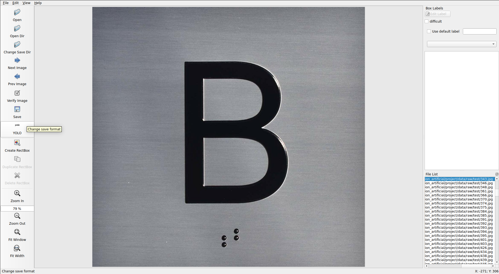

# Data

Todos los datos fueron obtenidos de: [https://www.scidb.cn/en/detail?dataSetId=b1df1a601acc47a6984aafa8f3ab8e92](https://www.scidb.cn/en/detail?dataSetId=b1df1a601acc47a6984aafa8f3ab8e92). En concreto, solo se están tomando las imagenes de `segment_label`, los `.json` los estamos ignorando porque no sabemos qué tanta compatibilidad haya con labelImg y YOLO.

Los datos están separados por entrenamiento y testo, en las carpetas [train](./train/) y [test](./test/), respectivamente.

Los etiquetamientos se hacen utilizando el paquete de `labelImg`, utilizando por ejemplo, el comando: `labelImg ./data/train/`, para luego cambiar el formato de guardado a YOLO, como se ve en la imagen de abajo. El nombre de la clase que se utilizará es "Character" siempre. Luego, las etiquetas son guardadas en las carpetas llamadas `labels` dependiendo si se está trabajando en `train` o `test`.

## XML

En caso de haber utilizado el formato de guardado XML o "PascalVOC", se puede utilizar el archivo [xml_to_txt_yolo.py](./xml_to_txt_yolo.py) para convertir los archivos que están guardados en formato XML a TXT en formato yolo.
